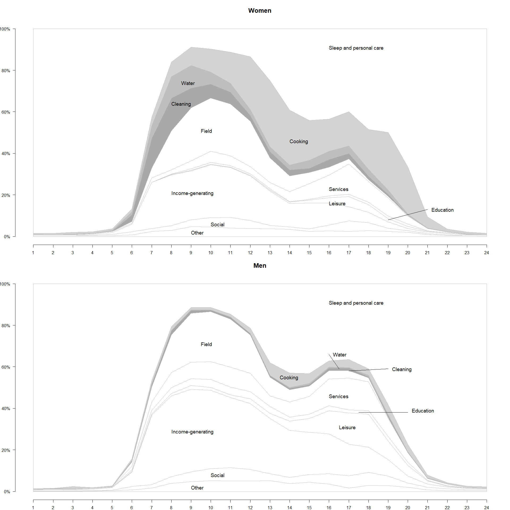
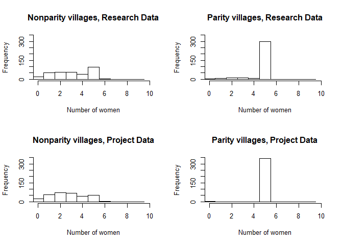

[This .Rmd](https://github.com/medinali/VDW-H-SDS_2018/blob/master/Replication.Rmd) file replicates the core analysis as well as additional results from ["The Effectiveness of Gender Quotas in Development Programming: Null Results from a Field Experiment in Congo"](http://www.macartan.nyc/wp-content/uploads/2018/03/WHS2018_Gender_Parity.pdf).

[Data](https://dataverse.harvard.edu/dataset.xhtml?persistentId=doi:10.7910/DVN/BSASJR) and [replication code files](https://github.com/medinali/VDW-H-SDS_2018/tree/master) can be found online.

Context information (Section 3)
===============================

Do people know the name of Congo's ruling party?

``` r
  partyData <- merge(ABD_INDIV, Tuungane_data, by = "IDV")  
  partyData <- filter(partyData, TUUNGANE ==0 & q72_know_party!="")
  partyinfo1 <- 100*prop.table(table(partyData$q72_know_party))
  names(partyinfo1) <- c("No", "Yes, correct","Yes, incorrect")

  partyinfo2 <- 100*prop.table(table(partyData$q72_know_party, partyData$q011_sex)[,4:5],2)

  partyinfo <-cbind(partyinfo1,partyinfo2)    
    
  colnames(partyinfo) =  c("Combined", "Women", "Men")
  rownames(partyinfo) =  c("No", "Yes, correct", "Yes, incorrect")
  kable(partyinfo, digits = 2)
```

|                |  Combined|  Women|    Men|
|----------------|---------:|------:|------:|
| No             |     66.54|  78.70|  54.69|
| Yes, correct   |     26.81|  15.89|  37.53|
| Yes, incorrect |      6.65|   5.41|   7.78|

Do people know the name of Congo's prime minister?

``` r
  pmData <- merge(ABD_INDIV, Tuungane_data, by = "IDV")  
  pmData <- filter(pmData, TUUNGANE ==0 & pmData$q70_know_pm!="")
  pm1 <- 100*prop.table(table(pmData$q70_know_pm,useNA ="no"))
  names(pm1) <- c("No", "Yes, correct","Yes, incorrect")

  pm2 <-100*prop.table(table(pmData$q70_know_pm, pmData$q011_sex)[,4:5],2)

  pm <-cbind(pm1,pm2)    

  colnames(pm) =  c("Combined", "Women", "Men")
  rownames(pm) =  c("No", "Yes, correct", "Yes, incorrect")
  kable(pm, digits = 2)
```

|                |  Combined|  Women|    Men|
|----------------|---------:|------:|------:|
| No             |     76.53|  85.59|  67.66|
| Yes, correct   |     17.28|  10.00|  24.50|
| Yes, incorrect |      6.19|   4.41|   7.85|

Who initiated development project (in percentages)?

``` r
  na_answers <- c("don't know", "doesn't know", "not applicable","refuse to respond", "refuses to respond")
  whoData <- merge(ABD_INDIV, Tuungane_data, by = "IDV")  
  whoData <- filter(whoData, TUUNGANE ==0 & !q46_1h %in% na_answers)

  # Who initiates development projects
  table_who <- round(100*prop.table(table(whoData$q46_1h)),2)
  kable(data.frame(table_who[4:30]), col.names=c("Actor", "Share"))
```

| Actor                           |  Share|
|:--------------------------------|------:|
| territory administrator         |   0.00|
| development committee           |   5.43|
| chef chefferie/ secteur         |   0.82|
| groupement chief                |   1.32|
| locality chief                  |   1.32|
| chief of sub-village            |   0.33|
| chief of village                |   4.11|
| religious chief                 |   0.66|
| women                           |   0.33|
| men                             |   0.66|
| youth                           |   0.33|
| women organization              |   0.33|
| youth organization              |   0.33|
| the old                         |   0.16|
| member of development committee |   1.81|
| inhabitants of the villages     |  16.12|
| NGOs                            |  52.63|
| private sector                  |   2.96|
| immigrants                      |   0.16|
| emmigrants                      |   0.16|
| members of armed groups         |   0.16|
| government                      |   3.29|
| most poor                       |   0.16|
| ex-combattants                  |   0.00|
| teacher                         |   0.33|
| doctor                          |   0.00|
| other                           |   6.09|

Time allocation on daily activities (Figure 1)
----------------------------------------------

``` r
#####################
## DRAW FIGURE
#####################

par(mfrow=c(2,1))
x <- seq(1,24,1)
yZERO <- rep(0,24)
yHUNDRED <- rep(100,24)

#####################
## FOR WOMEN
#####################

par(mar = c(2, 3, 4, 1)) # b, l, t, r

  plot(0,0, xlim=c(1,24), ylim=c(0,100), xlab="", ylab="", cex.lab=1.5, axes=F, frame.plot=F, type="n", main="Women", cex.main=1.5)
axis(1, at=seq(1,24,1), cex.axis=1)
axis(2, at=seq(0,100,20), cex.axis=1, label=c("0%", "20%", "40%", "60%", "80%", "100%"), las=1)

# draw polygons
  polygon(c(x,rev(x)),c(other[1,],rev(yHUNDRED)),col="white", border = "gray")
  polygon(c(x,rev(x)),c(org[1,],rev(yHUNDRED)),col="white", border = "gray")
  polygon(c(x,rev(x)),c(money[1,],rev(yHUNDRED)),col="white", border = "gray")
  polygon(c(x,rev(x)),c(sport[1,],rev(yHUNDRED)),col="white", border = "gray")
  polygon(c(x,rev(x)),c(edu[1,],rev(yHUNDRED)),col="white", border = "gray")
  polygon(c(x,rev(x)),c(personal[1,],rev(yHUNDRED)),col="white", border = "gray")
  polygon(c(x,rev(x)),c(domestic[1,],rev(yHUNDRED)),col="white", border = "gray")
  polygon(c(x,rev(x)),c(cleaning[1,],rev(yHUNDRED)),col="darkgray", border = "gray")
  polygon(c(x,rev(x)),c(water[1,],rev(yHUNDRED)),col="gray", border = "gray")
  polygon(c(x,rev(x)),c(cooking[1,],rev(yHUNDRED)),col="lightgray", border = "gray")
  polygon(c(x,rev(x)),c(sleep[1,],rev(yHUNDRED)),col="white", border = "gray")

# Add text
  text(9, 1, "Other", cex=1.2,adj = c(0,0))
  text(10, 5, "Social", cex=1.2,adj = c(0,0))
  text(8, 20, "Income-generating", cex=1.2,adj = c(0,0))
  text(16, 15, "Leisure", cex=1.2,adj = c(0,0))
  text(21.2, 12, "Education", cex=1.2,adj = c(0,0))
  lines(c(19,21),c(8,13), cex=2, lwd=1.2)
  text(16, 22, "Services", cex=1.2,adj = c(0,0))
  text(9.5, 50, "Field", cex=1.2,adj = c(0,0))
  text(8, 63, "Cleaning", cex=1.2,adj = c(0,0))
  text(8.5, 73, "Water", cex=1.2,adj = c(0,0))
  text(14, 45, "Cooking", cex=1.2,adj = c(0,0))
  text(16, 90, "Sleep and personal care", cex=1.2,adj = c(0,0))


#####################
## FOR MEN
#####################

  par(mar = c(2, 3, 4, 1)) # b, l, t, r

  plot(0,0, xlim=c(1,24), ylim=c(0,100), xlab="", ylab="", cex.lab=1.5, axes=F, frame.plot=F, type="n", main="Men", cex.main=1.5)
  axis(1, at=seq(1,24,1), cex.axis=1)
  axis(2, at=seq(0,100,20), cex.axis=1, label=c("0%", "20%", "40%", "60%", "80%", "100%"), las=1)

  # draw polygons
  polygon(c(x,rev(x)),c(other[2,],rev(yHUNDRED)),col="white", border = "gray")
  polygon(c(x,rev(x)),c(org[2,],rev(yHUNDRED)),col="white", border = "gray")
  polygon(c(x,rev(x)),c(money[2,],rev(yHUNDRED)),col="white", border = "gray")
  polygon(c(x,rev(x)),c(sport[2,],rev(yHUNDRED)),col="white", border = "gray")
  polygon(c(x,rev(x)),c(edu[2,],rev(yHUNDRED)),col="white", border = "gray")
  polygon(c(x,rev(x)),c(personal[2,],rev(yHUNDRED)),col="white", border = "gray")
  polygon(c(x,rev(x)),c(domestic[2,],rev(yHUNDRED)),col="white", border = "gray")
  polygon(c(x,rev(x)),c(cleaning[2,],rev(yHUNDRED)),col="darkgray", border = "gray")
  polygon(c(x,rev(x)),c(water[2,],rev(yHUNDRED)),col="gray", border = "gray")
  polygon(c(x,rev(x)),c(cooking[2,],rev(yHUNDRED)),col="lightgray", border = "gray")
  polygon(c(x,rev(x)),c(sleep[2,],rev(yHUNDRED)),col="white", border = "gray")

  # Add text
  text(9, 1, "Other", cex=1.2,adj = c(0,0))
  text(10, 7, "Social", cex=1.2,adj = c(0,0))
  text(8, 28, "Income-generating", cex=1.2,adj = c(0,0))
  text(16.5, 30, "Leisure", cex=1.2,adj = c(0,0))
  text(20.2, 38.1, "Education", cex=1.2,adj = c(0,0))
  lines(c(17.5,20),c(38.1,38.1), cex=2, lwd=1.2)
  text(16, 45, "Services", cex=1.2,adj = c(0,0))
  text(9.5, 70, "Field", cex=1.2,adj = c(0,0))
  text(19.2, 58, "Cleaning", cex=1.2,adj = c(0,0))
  lines(c(17,19),c(58,59), cex=2, lwd=1.2)
  text(16.2, 65, "Water", cex=1.2,adj = c(0,0))
  lines(c(16.5,16),c(59,66), cex=2, lwd=1.2)
  text(13.5, 54, "Cooking", cex=1.2,adj = c(0,0))
  text(16, 90, "Sleep and personal care", cex=1.2,adj = c(0,0))
```



``` r
 gender_plot <-  recordPlot()
```

    ## png 
    ##   2

Project preferences by gender (Table 1)
---------------------------------------

``` r
prefs_table <- 
  sapply(pprojects, function(k) {
    output_function(lm_cluster_robust(paste(k, "~ female + as.factor(lott_bin)"), 
                                      data = prefsData, 
                                      cluster_name = "CDCCODE"), coefrows=2:3)})


## Control means in
means <-  apply(filter(prefsData, female==0)[, pprojects], 2, mean, na.rm=TRUE)
prefs_table <-rbind(prefs_table[1:2,], round(means,3), prefs_table[nrow(prefs_table),])
row.names(prefs_table) <- c("Parity Effect", "(se)", "Control", "N")
  
kable(prefs_table[,1:6])
```

|               | health  | edu    | transport | watsan  | agri    | private |
|---------------|:--------|:-------|:----------|:--------|:--------|:--------|
| Parity Effect | -0.029  | -0.028 | -0.019    | 0.012   | 0.005   | 0.042\* |
| (se)          | (0.026) | (0.02) | (0.015)   | (0.024) | (0.033) | (0.023) |
| Control       | 0.158   | 0.115  | 0.047     | 0.158   | 0.269   | 0.039   |
| N             | 543     | 543    | 543       | 543     | 543     | 543     |

``` r
# Are women's preferences in parity villages closer to men's preferences?
prefsData2 <- DMC
prefsData2$female <- 1* (prefsData2$av_10_gender == "female")

prefs_par_table <-
  sapply(pprojects, function(k) {
    # output_function(
    M <- lm_cluster_robust(paste(k, "~ female*cdc_parity + as.factor(lott_bin)"), data = prefsData2,
                                      cluster_name = "CDCCODE")#, coefrows=2:3)})
    coefs <- M[[1]][rownames(M[[1]]) %in% c("(Intercept)", "female","cdc_parity","female:cdc_parity"),]
    beta = round(coefs[,"Estimate"], 3)
    se = round(coefs[,"Std. Error"], 3)
    stars =  unlist(lapply(coefs[,"Pr(>|t|)"], function(p) ifelse(p <= .01, "***", ifelse(p <= .05, "**", ifelse(p <= .1, "*", "")))))
    return(rbind(paste0(beta, stars), paste0("(",se,")")))
    })

prefs_par_table <- cbind(c("male","", "female", "","cdc_parity", "", "female*cdc_parity",""), prefs_par_table)
```

Share of project preferences, by gender (in text)
-------------------------------------------------

``` r
  abs_f <- colSums(prefsData[prefsData$female==1,pprojects], na.rm = TRUE)
  pct_pref_f <- round(abs_f/sum(abs_f), 3)
  
  abs_m <- colSums(prefsData[prefsData$female==0,pprojects], na.rm = TRUE)
  pct_pref_m <- round(abs_m/sum(abs_m), 3)

  kable(data.frame(female = pct_pref_f, male = pct_pref_m, row.names = c("health", "education", "transport", "watsan","agriculture","private", "other")))
```

|             |  female|   male|
|-------------|-------:|------:|
| health      |   0.121|  0.158|
| education   |   0.087|  0.115|
| transport   |   0.027|  0.047|
| watsan      |   0.178|  0.158|
| agriculture |   0.269|  0.269|
| private     |   0.080|  0.039|
| other       |   0.239|  0.215|

Additional check on preference heterogeneity
--------------------------------------------

Does gender explain variation in preferences at more local levels? To answer this question, we explore variation within lottery bins. Specifically, we conduct an analysis of variance (ANOVA) comparing a model where project preferences are regressed on lottery bins, and a model where project preferences are regressed on lottery bins interacted with gender. We present p-values for F-tests for the null that the interaction term is zero. Except for the private goods category, we cannot reject the null that preferences are the same across gender groups in each of the lottery bin areas in the study.

``` r
any_het <- sapply(pprojects, function(k) {
    M_full <- lm(as.formula(paste(k, "~ female*as.factor(lott_bin)")), 
                                      data = prefsData)
    M_reduced <- lm(as.formula(paste(k, "~ as.factor(lott_bin)")), 
                                      data = prefsData)
    A <- anova(M_reduced, M_full)
    return(c(k, round(A$`Pr(>F)`[[2]],3)))
})

rownames(any_het) <- c("sector","F-test p-value")
colnames(any_het) <- NULL
kable(any_het)
```

|                |        |       |           |        |       |         |       |
|:---------------|:-------|:------|:----------|:-------|:------|:--------|:------|
| sector         | health | edu   | transport | watsan | agri  | private | other |
| F-test p-value | 0.53   | 0.918 | 0.678     | 0.906  | 0.777 | 0       | 0.992 |

Position in the village (in text)
---------------------------------

Presence at a village meeting:

``` r
  ind_t <- merge(ABD_INDIV, Tuungane_data, by = "IDV")
  ind_t <- ind_t %>% 
    filter(TUUNGANE == 0) %>%
    mutate(female = 1* (q011_sex == "no"))
  
  presData <- ind_t %>%
    filter(!q079_a_meeting %in% na_answers) %>%
    mutate(q079_a_meeting = 1 * (q079_a_meeting == "yes"))

  pres <- 100*prop.table(table(presData$q079_a_meeting, presData$q011_sex)[,4:5],2)
  colnames(pres) =  c("Women", "Men")
  rownames(pres) =  c("Not present", "Present")
  kable(pres, digits = 2)
```

|             |  Women|    Men|
|-------------|------:|------:|
| Not present |  72.37|  55.79|
| Present     |  27.63|  44.21|

Participated in last village meeting:

``` r
  discData <- ind_t %>%
    filter(!q079_b_discours %in% na_answers) %>%
    mutate(q079_b_discours <- 1* (q079_b_discours == "yes"))
  
  disc <- 100*prop.table(table(discData$q079_b_discours, discData$q011_sex)[,4:5],2)
  disc <- disc[4:5,]
  colnames(disc) =  c("Women", "Men")
  rownames(disc) =  c("Not spoke", "Spoke")
  kable(disc, digits = 2)
```

|           |  Women|    Men|
|-----------|------:|------:|
| Not spoke |  62.84|  28.43|
| Spoke     |  37.16|  71.57|

Attitudes towards women by gender (Table 2)
-------------------------------------------

``` r
attitudes2 <- attitudes[1:4]
Genderatt  <-  sapply(attitudes2, function(y) {
                M <- lm(attsData[,y] ~ female + as.factor(lott_bin.x), data = attsData, na.action="na.exclude")
               output_function(cluster_robust(M, attsData$IDS_CDCCODE))
                 })

Genderatt <- Genderatt[c(1:2,7),]
attitudes_labs2 <- attitudes_labs[1:4]
colnames(Genderatt) <- attitudes_labs2

## Controls means in
means <-  apply(filter(attsData, female==0)[, attitudes2], 2, mean, na.rm=TRUE)

Genderatt <-rbind(Genderatt[1:2,], round(means,3), Genderatt[3,])
row.names(Genderatt) <- c("Parity Effect", "(se)", "Control", "N")

kable(Genderatt)
```

|               | Same rights | Complain/mistreat | Soc-Admin Pos | Eligible Pres |
|---------------|:------------|:------------------|:--------------|:--------------|
| Parity Effect | -0.103      | -0.085            | -0.062        | 0             |
| (se)          | (0.082)     | (0.088)           | (0.08)        | (0.069)       |
| Control       | 0.24        | 0.546             | 0.802         | 0.796         |
| N             | 950         | 950               | 951           | 957           |

Perceptions of chief (in text)
------------------------------

Who should do beneficiary selection?

``` r
  respontab <- ind %>%
    filter(q011_sex %in% c("yes", "no")) %>%
    filter(qd002_must_be1 != "") %>%
    group_by(qd002_must_be1) %>%
    summarize(Women = sum(q011_sex == "yes"),
              Men = sum(q011_sex == "no"),
              Combined = n()) %>%
    ungroup()
  
  respontab <- cbind(respontab[,1], apply(respontab[,-1], 2, function(x) 100*prop.table(x)))
  kable(respontab, digits = 2)
```

| qd002\_must\_be1          |  Women|    Men|  Combined|
|:--------------------------|------:|------:|---------:|
| 1 The Villagers           |  24.10|  22.41|     23.27|
| 2 Village chief           |  52.64|  51.08|     51.87|
| 3 The wise of the village |   6.98|   6.68|      6.83|
| 4 Religious chiefs        |   9.94|  10.78|     10.35|
| 5 Youth associations      |   1.69|   0.00|      0.85|
| 6 Women associations      |   0.85|   0.86|      0.85|
| 7 the chief of Chefferie  |   0.21|   2.59|      1.39|
| 8 A state representative  |   2.11|   3.23|      2.67|
| 9 None                    |   1.48|   2.37|      1.92|

Lottery information and manipulation check (Section)
====================================================

Lottery information (Table 3)
-----------------------------

Information about block and cluster structure. Table showing the number of clusters in each of the 43 blocks (in rows) and the number of cluster in the parity condition (in columns) according to project data.

``` r
collapsed  <- Lottery %>%
  dplyr::select(lott_bin, pilot_lottery, cdc_parity) %>%
  dplyr::filter(pilot_lottery==1) %>%
  group_by(lott_bin) %>%
  summarise(share = sum(cdc_parity), size = length(cdc_parity)) %>%
  as.data.frame %>%
  dplyr::select(-lott_bin)%>% 
  table

x <- (t(collapsed))
kable(x)
```

|     |    0|    1|    2|    3|    4|    5|    6|
|-----|----:|----:|----:|----:|----:|----:|----:|
| 1   |    4|    3|    0|    0|    0|    0|    0|
| 2   |    0|   11|    0|    0|    0|    0|    0|
| 3   |    0|    4|    4|    0|    0|    0|    0|
| 4   |    0|    0|    6|    0|    1|    0|    0|
| 5   |    0|    0|    2|    1|    0|    0|    0|
| 6   |    0|    0|    0|    3|    0|    0|    0|
| 7   |    0|    0|    1|    0|    0|    0|    0|
| 8   |    0|    0|    0|    0|    1|    0|    0|
| 9   |    0|    0|    0|    0|    0|    1|    0|
| 11  |    0|    0|    0|    0|    0|    0|    1|

Manipulation Checks
-------------------

Based on research data (used in the text), and project data (used as robustness test):

``` r
  # First Stage
  # research data
  lm_cluster_robust("femmes~cdc_parity", IRC_tracking[IRC_tracking$pilot_lottery==1,], "IDV_CDCCODE")[[1]]
```

    ## 
    ## t test of coefficients:
    ## 
    ##             Estimate Std. Error t value  Pr(>|t|)    
    ## (Intercept)  3.08951    0.15764 19.5991 < 2.2e-16 ***
    ## cdc_parity   1.58408    0.18494  8.5655 < 2.2e-16 ***
    ## ---
    ## Signif. codes:  0 '***' 0.001 '**' 0.01 '*' 0.05 '.' 0.1 ' ' 1

``` r
  # project data
  lm_cluster_robust("femmes~cdv_parity", IRC_tracking[IRC_tracking$pilot_lottery==1,], "IDV_CDCCODE")[[1]]
```

    ## 
    ## t test of coefficients:
    ## 
    ##             Estimate Std. Error t value  Pr(>|t|)    
    ## (Intercept)  2.72063    0.13358  20.367 < 2.2e-16 ***
    ## cdv_parity   2.24757    0.13510  16.637 < 2.2e-16 ***
    ## ---
    ## Signif. codes:  0 '***' 0.001 '**' 0.01 '*' 0.05 '.' 0.1 ' ' 1

Core Tables plus robustness checks (Section 5)
==============================================

We have four core tables on Tuungane project choice, RAPID project choice, behavior and attitudes. We replicate all four tables and with each one provide two robustness results, one using project rather than research team coding on treatment, and the other reporting a LATE analysis with research data (assignment) instrumenting for project data (implementation).

Tuungane Project Choice (Table 5)
---------------------------------

Effects of the parity requirement:

``` r
project_choice_main <-
    sapply(projects, function(k) {
      #    sapply(X, function(j) {
      output_function(lm_cluster_robust(paste(k, "~cdc_parity + as.factor(lott_bin)"),
                                        data = IRC_tracking[IRC_tracking$pilot_lottery==1,],
                                        cluster_name = "IDV_CDCCODE"), coefrow = 2) })

means <-  apply(filter(IRC_tracking, cdc_parity==0, pilot_lottery==1)[, projects], 2, mean, na.rm=TRUE)
project_choice_main <-rbind(project_choice_main[1:2,], round(means,3), project_choice_main[3,])

colnames(project_choice_main) <- c("Health", "Education", "Transport", "Watsan", "Agri.")
kable(project_choice_main)
```

| Health  | Education | Transport | Watsan     | Agri.   |
|:--------|:----------|:----------|:-----------|:--------|
| 0.028   | 0         | 0.026     | -0.059\*\* | 0.022   |
| (0.024) | (0.033)   | (0.021)   | (0.025)    | (0.015) |
| 0.124   | 0.513     | 0.066     | 0.182      | 0.047   |
| 654     | 654       | 654       | 654        | 654     |

### Robustness test: using project coding (Table 14)

Robustness test, substituting project data for research data:

``` r
project_choice_robust <-
    sapply(projects, function(k) {
      #    sapply(X, function(j) {
      output_function(lm_cluster_robust(paste(k, "~cdv_parity + as.factor(lott_bin)"),
                                        data = IRC_tracking[IRC_tracking$pilot_lottery==1,],
                                        cluster_name = "IDV_CDCCODE"), coefrow = 2) })

means2 <-  apply(filter(IRC_tracking, cdv_parity==0, pilot_lottery==1)[, projects], 2, mean, na.rm=TRUE)


project_choice_robust <-   rbind(project_choice_robust[1:2,], round(means2,2), project_choice_robust[3,])

  
colnames(project_choice_robust) <- c("Health", "Education", "Transport", "Watsan", "Agri.")
kable(project_choice_robust)
```

| Health  | Education | Transport | Watsan       | Agri.   |
|:--------|:----------|:----------|:-------------|:--------|
| 0.003   | 0.067\*\* | 0.019     | -0.086\*\*\* | 0       |
| (0.024) | (0.033)   | (0.021)   | (0.024)      | (0.015) |
| 0.13    | 0.48      | 0.07      | 0.2          | 0.06    |
| 654     | 654       | 654       | 654          | 654     |

### Robustness test: LATE analysis (Table 18)

Finally, we conduct a LATE analysis by treating the research project records of where parity ought to have been imposed with project records of where in fact it was imposed. There is relatively small non compliance and a very strong first stage. The Table below reports the local average treatment effect for each project.

``` r
  D <- IRC_tracking[c(projects, "pilot_lottery", "cdc_parity", "cdv_parity", "lott_bin", "IDV_CDCCODE")]
  D <- D[complete.cases(D),]

  late_T <- sapply(projects, function(y) {
    D$Y <- as.vector(unlist(D[y]))
    M <- ivreg(Y~cdv_parity + as.factor(lott_bin) | cdc_parity + as.factor(lott_bin), data = D, na.action="na.exclude")
    output_function(cluster_robust(M, D$IDV_CDCCODE))
  })
  projects_labs <- c("Health", "Education", "Transport", "WatSan", "Agric.")
  colnames(late_T) <- projects_labs

  means3 <-  apply(filter(IRC_tracking, cdv_parity==0, pilot_lottery==1)[, projects], 2, mean, na.rm=TRUE)

  late_T <- rbind(late_T[c(1,2),], round(means3,2), late_T[7,])

colnames(late_T) <- c("Health", "Education", "Transport", "Watsan", "Agri.")
kable(late_T, digits = 2)
```

| Health  | Education | Transport | Watsan     | Agri.   |
|:--------|:----------|:----------|:-----------|:--------|
| 0.04    | 0         | 0.036     | -0.083\*\* | 0.031   |
| (0.034) | (0.047)   | (0.029)   | (0.034)    | (0.021) |
| 0.13    | 0.48      | 0.07      | 0.2        | 0.06    |
| 654     | 654       | 654       | 654        | 654     |

### Additional statistic on omnibus result

To run an omnibus test for the null hypothesis that the choices were the same in parity and nonparity areas we code a variable `choice` that takes on a different value for each sector. There is a complication in that some areas chose projects in multiple sectors; to take account of this we create a distinct category for "mixed", which we further refine to "mixed including education" and "mixed other". In all we have seven categories to which we apply a *χ*<sup>2</sup> test.

``` r
IRC_tracking$choice <- NA
for(j in 1:length(projects)){
  x <- IRC_tracking[projects[j]]
  IRC_tracking$choice[x ==1] <- j
  IRC_tracking$choice[x>0 & x<1]   <- -2
}
IRC_tracking$choice[IRC_tracking$education2 > 0 & IRC_tracking$education2 < 1]  <- -1

proj_table <- table(IRC_tracking$choice, IRC_tracking$cdc_parity)
rownames(proj_table) <- c("Residual category", "Mixed incl education" , projects)
kable(proj_table, col.names = c("Non-parity", "parity"))
```

|                      |  Non-parity|  parity|
|----------------------|-----------:|-------:|
| Residual category    |          33|      50|
| Mixed incl education |          61|      53|
| sante2               |          26|      34|
| education2           |         133|     144|
| transport2           |          17|      21|
| watsan2              |          28|      22|
| agr2                 |           6|       8|

``` r
print(chisq.test(table(IRC_tracking$choice, IRC_tracking$cdc_parity)))
```

    ## 
    ##  Pearson's Chi-squared test
    ## 
    ## data:  table(IRC_tracking$choice, IRC_tracking$cdc_parity)
    ## X-squared = 5.752, df = 6, p-value = 0.4515

``` r
print(chisq.test(table(IRC_tracking$choice, IRC_tracking$cdv_parity)))
```

    ## 
    ##  Pearson's Chi-squared test
    ## 
    ## data:  table(IRC_tracking$choice, IRC_tracking$cdv_parity)
    ## X-squared = 10.762, df = 6, p-value = 0.09603

We fail to reject the null that the distribution across these seven categories is different in treatment and control (*p* = 0.451533). Using the project report of where parity was implemented (project data) we have a lower *p* value of *p* = 0.0960307.

### Tuungane project choice only for the 105 RAPID villages under study (Table 12)

``` r
project_choice_mainRAPID  <- sapply(projects, function(k) {
      output_function(lm_cluster_robust(paste(k, "~cdc_parity + as.factor(lott_bin)"),
                                        data = IRC_trackingRAPID[IRC_trackingRAPID$pilot_lottery==1,],
                                        cluster_name = "IDV_CDCCODE"), coefrow = 2) })
  
  
means <-  apply(filter(IRC_trackingRAPID, cdc_parity==0, pilot_lottery==1)[, projects], 2, mean, na.rm=TRUE)
project_choice_mainRAPID <-rbind(project_choice_mainRAPID[1:2,], round(means,3), project_choice_mainRAPID[3,])
  
colnames(project_choice_mainRAPID) <- c("Health", "Education", "Transport", "Watsan", "Agri.")
rownames(project_choice_mainRAPID) <- c("Parity Effect", "(se)", "Control", "N")

kable(project_choice_mainRAPID, digits = 2)
```

|               | Health  | Education | Transport | Watsan     | Agri.   |
|---------------|:--------|:----------|:----------|:-----------|:--------|
| Parity Effect | 0.034   | -0.002    | 0.024     | -0.065\*\* | 0.027   |
| (se)          | (0.027) | (0.045)   | (0.029)   | (0.031)    | (0.021) |
| Control       | 0.102   | 0.498     | 0.094     | 0.169      | 0.054   |
| N             | 443     | 443       | 443       | 443        | 443     |

RAPID project choice (Table 6)
------------------------------

Share of projects chosen under RAPID

``` r
abs <- colSums(rapid_projects[rapid_projects$pilot_lottery==1,c(RAPIDprojects, "RAPIDother")], na.rm=TRUE)
share_choice <- abs/sum(abs)
kable(share_choice)
```

|                  |          x|
|------------------|----------:|
| RAPIDhealth      |  0.0857143|
| RAPIDeducation   |  0.1047619|
| RAPIDtransport   |  0.0952381|
| RAPIDwatsan      |  0.1428571|
| RAPIDagriculture |  0.4000000|
| RAPIDprivate     |  0.0285714|
| RAPIDother       |  0.1428571|

Replicate Table 6 on the effects of the parity requirement on RAPID project choice:

``` r
project_choice_rapid <-
  sapply(RAPIDprojects, function(k) {
    output_function(lm_cluster_robust(paste(k, "~cdc_parity + as.factor(lott_bin)"),
                                      data = rapid_projects[rapid_projects$pilot_lottery==1,],
                                      cluster_name = "IDV_CDCCODE"), coefrow = 2) })

## Controls means in
rap_means <-  apply(filter(rapid_projects, cdc_parity==0, pilot_lottery==1)[, RAPIDprojects], 2, mean, na.rm=TRUE)
project_choice_rapid <-rbind(project_choice_rapid[1:2,], round(rap_means,3), project_choice_rapid[3,])

colnames(project_choice_rapid) <- c("Health", "Education", "Transport", "Watsan", "Agri.", "Private")
kable(project_choice_rapid)
```

| Health   | Education | Transport | Watsan  | Agri.   | Private |
|:---------|:----------|:----------|:--------|:--------|:--------|
| -0.107\* | -0.05     | 0.149\*\* | -0.001  | 0.011   | -0.022  |
| (0.06)   | (0.07)    | (0.068)   | (0.073) | (0.097) | (0.023) |
| 0.137    | 0.137     | 0.039     | 0.137   | 0.373   | 0.039   |
| 105      | 105       | 105       | 105     | 105     | 105     |

### Robustness test: using project coding (Table 15)

Robustness test, substituting project data for research data:

``` r
project_choice_rapid_project <-
    sapply(RAPIDprojects, function(k) {
      output_function(lm_cluster_robust(paste(k, "~cdv_parity + as.factor(lott_bin)"),
                                        data = rapid_projects[IRC_tracking$pilot_lottery==1,],
                                        cluster_name = "IDV_CDCCODE"), coefrow = 2) })
  project_choice_rapid_project
```

    ##      RAPIDhealth RAPIDeducation RAPIDtransport RAPIDwatsan
    ## [1,] "-0.061"    "0.023"        "0.004"        "-0.031"   
    ## [2,] "(0.062)"   "(0.073)"      "(0.069)"      "(0.068)"  
    ## [3,] "105"       "105"          "105"          "105"      
    ##      RAPIDagriculture RAPIDprivate
    ## [1,] "0.106"          "-0.022"    
    ## [2,] "(0.096)"        "(0.022)"   
    ## [3,] "105"            "105"

``` r
  rap_means2 <-  apply(filter(rapid_projects, cdv_parity==0, pilot_lottery==1)[, RAPIDprojects], 2, mean, na.rm=TRUE)
  project_choice_rapid_project <-rbind(project_choice_rapid_project[1:2,], round(rap_means2,3), project_choice_rapid_project[3,])

colnames(project_choice_rapid_project) <- c("Health", "Education", "Transport", "Watsan", "Agri.", "Private")
kable(project_choice_rapid_project)
```

| Health  | Education | Transport | Watsan  | Agri.   | Private |
|:--------|:----------|:----------|:--------|:--------|:--------|
| -0.061  | 0.023     | 0.004     | -0.031  | 0.106   | -0.022  |
| (0.062) | (0.073)   | (0.069)   | (0.068) | (0.096) | (0.022) |
| 0.12    | 0.1       | 0.1       | 0.14    | 0.34    | 0.04    |
| 105     | 105       | 105       | 105     | 105     | 105     |

### Robustness test: LATE analysis (Table 19)

LATE analysis again done using IV on all outcome variables where researcher lottery data is an instrument for the implementation recording on committee structure.

``` r
D <- rapid_projects[rapid_projects$pilot_lottery==1,][c(RAPIDprojects,  "cdc_parity", "cdv_parity", "lott_bin", "IDV_CDCCODE")]

  D <- D[complete.cases(D),]

  late_R <- sapply(RAPIDprojects, function(y) {
    D$Y <- as.vector(unlist(D[y]))
    M <- ivreg(Y~cdv_parity + as.factor(lott_bin) | cdc_parity + as.factor(lott_bin), data = D, na.action="na.exclude")
    output_function(cluster_robust(M, D$IDV_CDCCODE))
  })

    colnames(late_R) <-  RAPID_projects_labs
    rap_means3 <-  apply(filter(rapid_projects, cdv_parity==0, pilot_lottery==1)[, RAPIDprojects], 2, mean, na.rm=TRUE)
    late_R <-rbind(late_R[1:2,], round(rap_means3,3), late_R[7,])

kable(late_R, digits = 2)
```

| Health   | Education | Transport | WatSan  | Agric.  | Private |
|:---------|:----------|:----------|:--------|:--------|:--------|
| -0.204\* | -0.094    | 0.283\*   | -0.001  | 0.021   | -0.042  |
| (0.12)   | (0.139)   | (0.152)   | (0.139) | (0.184) | (0.044) |
| 0.12     | 0.1       | 0.1       | 0.14    | 0.34    | 0.04    |
| 105      | 105       | 105       | 105     | 105     | 105     |

### Additional analysis on RAPID project preferences (Table 13, Appendix E)

Do women's stated preferences translate into project choices at higher rates (relative to men's preferences) in parity areas? The next table shows the results.

|                  | Course measure | Fine measure |
|------------------|:---------------|:-------------|
| Parity Condition | -0.088         | 0.026        |
| (se)             | (0.075)        | (0.069)      |
| Male             | -0.06          | 0.014        |
| (se)             | (0.049)        | (0.043)      |
| Interaction      | 0.145\*\*      | 0.001        |
| (se)             | (0.074)        | (0.067)      |
| N                | 444            | 444          |

### Additional statistic on omnibus result

``` r
rapid_projects$choice <- NA
for(j in 1:length(RAPIDprojects)){
  x <- rapid_projects[RAPIDprojects[j]]
  rapid_projects$choice[x ==1] <- j
}

rproj_table <- table(rapid_projects$choice, rapid_projects$cdc_parity)
rownames(rproj_table) <- c(RAPIDprojects)
kable(rproj_table, col.names = c("Non-parity", "parity"))
```

|                  |  Non-parity|  parity|
|------------------|-----------:|-------:|
| RAPIDhealth      |           7|       2|
| RAPIDeducation   |           7|       4|
| RAPIDtransport   |           2|       8|
| RAPIDwatsan      |           7|       8|
| RAPIDagriculture |          19|      23|
| RAPIDprivate     |           2|       1|

``` r
print(chisq.test(table(rapid_projects$choice, rapid_projects$cdc_parity)))
```

    ## Warning in chisq.test(table(rapid_projects$choice, rapid_projects
    ## $cdc_parity)): Chi-squared approximation may be incorrect

    ## 
    ##  Pearson's Chi-squared test
    ## 
    ## data:  table(rapid_projects$choice, rapid_projects$cdc_parity)
    ## X-squared = 7.9364, df = 5, p-value = 0.1598

``` r
print(chisq.test(table(rapid_projects$choice, rapid_projects$cdv_parity)))
```

    ## Warning in chisq.test(table(rapid_projects$choice, rapid_projects
    ## $cdv_parity)): Chi-squared approximation may be incorrect

    ## 
    ##  Pearson's Chi-squared test
    ## 
    ## data:  table(rapid_projects$choice, rapid_projects$cdv_parity)
    ## X-squared = 2.6264, df = 5, p-value = 0.7574

Other Behavioral Results Based on RAPID
---------------------------------------

Share of interventions by women in RAPID committees (in text):

``` r
int <- discussion_gender_village %>% group_by(cdc_parity) %>% summarize(`share of interventions by women`= mean(female, na.rm=TRUE))
kable(int)
```

|  cdc\_parity|  share of interventions by women|
|------------:|--------------------------------:|
|            0|                        0.2660869|
|            1|                        0.2588149|

Average RAPID committee size (in text):

``` r
avg_n <- round(with(committee_gender, mean(men[!is.na(share_women)] + women[!is.na(share_women)], na.rm = TRUE)), 3)
avg_women <- round(with(committee_gender, mean(women[!is.na(share_women)], na.rm = TRUE)), 3)
kable(rbind(avg_n, avg_women))
```

|            |       |
|:-----------|------:|
| avg\_n     |  7.562|
| avg\_women |  1.705|

Number of gender-balanced committes by participation in Tungane (in text):

``` r
committee_gender %>% subset(!is.na(share_women)) %>% group_by(women) %>% summarise(pct = n()/nrow(.))
```

    ## # A tibble: 5 x 2
    ##   women   pct
    ##   <int> <dbl>
    ## 1     0 0.171
    ## 2     1 0.324
    ## 3     2 0.238
    ## 4     3 0.162
    ## 5     4 0.105

``` r
t <- table(committee_gender$share_women == .0, committee_gender$cdc_parity)
t <- table(committee_gender$share_women >= .5, committee_gender$cdc_parity)
rownames(t) <- c("Share women < .5", "Share women >= .5")
colnames(t) <- c("Non-Parity", "Parity")
kable(t)
```

|                      |  Non-Parity|  Parity|
|----------------------|-----------:|-------:|
| Share women &lt; .5  |          45|      47|
| Share women &gt;= .5 |           6|       7|

### Effects of the parity requirement (Table 7)

``` r
tab_input <- cbind(
              mapply(
                df   = list(meetings_gender, discussion_gender_village, committee_gender),
                depvar = c("sharewomenA", "female", "share_women"),
                          
                  function(df, depvar){
                    col <- output_function( 
                              lm_cluster_robust(paste0(depvar, "~ cdc_parity + as.factor(lott_bin)"),
                              data = df,
                              cluster_name = "IDV_CDCCODE"), 
                            coefrows=2)
                    col <- c(col[1:2], format(round(mean(df[df$cdc_parity==0 & df$pilot_lottery==1, depvar], na.rm = TRUE),3), nsmall=3),col[3])
                            
                   return(col)
                   }))

colnames(tab_input) <- c("Present", "Interventions", "Composition")
rownames(tab_input) <- c("Effect", "se", "Control", "N")

kable(tab_input)
```

|         | Present | Interventions | Composition |
|---------|:--------|:--------------|:------------|
| Effect  | -0.007  | -0.004        | 0.017       |
| se      | (0.026) | (0.031)       | (0.036)     |
| Control | 0.439   | 0.266         | 0.220       |
| N       | 104     | 105           | 105         |

### Robustness test: using project coding (Table 16)

Robustness test, substituting project data for research data:

``` r
tab_input2 <- cbind(
                mapply(
                  df = list(meetings_gender, discussion_gender_village, committee_gender),
                  depvar = c("sharewomenA", "female", "share_women"),
                  
                  function(df, depvar){
                    col <- output_function(
                      lm_cluster_robust(paste0(depvar, "~cdv_parity + as.factor(lott_bin)"),
                                                                      data = df, cluster_name = "IDV_CDCCODE"),       
                          coefrows=2)
                    col <- c(col[1:2], format(round(mean(df[df$cdv_parity==0 & df$pilot_lottery==1, depvar], na.rm = TRUE),3), nsmall=3), col[3])
                      return(col)
                  }))

colnames(tab_input2) <- c("Present", "Interventions", "Composition")
rownames(tab_input2) <- c("Effect", "se", "Control", "N")

kable(tab_input2)
```

|         | Present | Interventions | Composition |
|---------|:--------|:--------------|:------------|
| Effect  | -0.023  | 0.055\*       | 0.016       |
| se      | (0.026) | (0.033)       | (0.036)     |
| Control | 0.450   | 0.240         | 0.220       |
| N       | 104     | 105           | 105         |

### Robustness test: LATE analysis (Table 20)

LATE analysis again done using IV on all outcome variables where researcher lottery data is an instrument for the implementation recording on committee structure.

``` r
tab_inputLATE <- cbind(mapply(df = list(meetings_gender, discussion_gender_village, committee_gender),
                           depvar = c("sharewomenA", "female", "share_women"),
                           
                           function(df, depvar){
                             D <- df[,c(depvar, "cdv_parity", "cdc_parity", "lott_bin", "IDV_CDCCODE")]
                             D <- D[complete.cases(D),]
                             M <- ivreg(as.formula(paste(depvar, "~ cdv_parity + as.factor(lott_bin) | cdc_parity + as.factor(lott_bin)")),  data = D, na.action="na.exclude")
                             col <-  output_function(cluster_robust(M, D$IDV_CDCCODE))
                             col <- c(col[1:2],
                                      format(round(mean(df[df$cdv_parity==0 & df$pilot_lottery==1, depvar], na.rm = TRUE),3)),
                                      col[rownames(col)=="N"])
                             return(col)
                           }))

colnames(tab_inputLATE) <- c("were present", "spoke", "were on committee")
rownames(tab_inputLATE) <- c("Estimate", "se.", "Nonparity", "N")

colnames(tab_inputLATE) <- c("Present", "Interventions", "Composition")
rownames(tab_inputLATE) <- c("Effect", "se", "Control", "N")
kable(tab_inputLATE, digits = 3)
```

|         | Present | Interventions | Composition |
|---------|:--------|:--------------|:------------|
| Effect  | -0.011  | -0.007        | 0.032       |
| se      | (0.042) | (0.053)       | (0.068)     |
| Control | 0.45    | 0.24          | 0.22        |
| N       | 104     | 105           | 105         |

Attitudes towards women (Table 8)
---------------------------------

Replicate Table 8 on the effects of the parity requirement:

``` r
attitudes_table <-
  sapply(attitudes, function(k) {
    output_function(lm_cluster_robust(paste(k, "~cdc_parity + as.factor(lott_bin)"),
                                      data = attitudes_data,
                                      cluster_name = "IDV_CDCCODE"), coefrows=2)})

## Controls means in
means <-  apply(filter(attitudes_data, cdc_parity==0, pilot_lottery==1)[, attitudes], 2, mean, na.rm=TRUE)
attitudes_table <-rbind(attitudes_table[1:2,], round(means,3), attitudes_table[3,])

colnames(attitudes_table) <- c("Same right", "Complain", "Positions", "President", "Index")
rownames(attitudes_table) <- c("Effect", "se", "Control", "N")

kable(attitudes_table)
```

|         | Same right | Complain | Positions | President | Index  |
|---------|:-----------|:---------|:----------|:----------|:-------|
| Effect  | 0.041      | -0.071   | -0.074    | -0.103    | -0.067 |
| se      | (0.125)    | (0.088)  | (0.095)   | (0.084)   | (0.08) |
| Control | 0.255      | 0.523    | 0.793     | 0.825     | 0      |
| N       | 912        | 904      | 916       | 919       | 930    |

### Robustness test: using project coding (Table 17)

Robustness test, substituting project data for research data:

``` r
## BASED ON PROJECT DATA
attitudes_tableR <-
  sapply(attitudes, function(k) {
    output_function(lm_cluster_robust(paste(k, "~cdv_parity + as.factor(lott_bin)"),
                                      data = attitudes_data,
                                      cluster_name = "IDV_CDCCODE"))})

means <-  apply(filter(attitudes_data, cdv_parity==0, pilot_lottery==1)[, attitudes], 2, mean, na.rm=TRUE)
attitudes_tableR <-rbind(attitudes_tableR[1:2,], round(means,3), attitudes_tableR[7,])

colnames(attitudes_tableR) <- c("Same right", "Complain", "Positions", "President", "Index")
rownames(attitudes_tableR) <- c("Effect", "se", "Control", "N")

kable(attitudes_tableR)
```

|         | Same right | Complain | Positions | President | Index   |
|---------|:-----------|:---------|:----------|:----------|:--------|
| Effect  | -0.109     | -0.064   | -0.018    | -0.051    | -0.072  |
| se      | (0.124)    | (0.089)  | (0.093)   | (0.082)   | (0.078) |
| Control | 0.315      | 0.519    | 0.764     | 0.799     | -0.002  |
| N       | 912        | 904      | 916       | 919       | 930     |

### Robustness test: LATE analysis (Table 21)

LATE analysis again done using IV on all outcome variables where researcher lottery data is an instrument for the implementation recording on committee structure.

``` r
## LATE

late_A <- sapply(attitudes, function(y) {
  D <- attitudes_data[attitudes_data$pilot_lottery==1,][c(y,  "cdc_parity", "cdv_parity", "lott_bin", "IDV_CDCCODE")]
  D <- D[complete.cases(D),]

  D$Y <- as.vector(unlist(D[y]))
  M <- ivreg(Y~cdv_parity + as.factor(lott_bin) | cdc_parity + as.factor(lott_bin), data = D, na.action="na.exclude")
  output_function((cluster_robust(M, D$IDV_CDCCODE)))
})

meansL <-  apply(filter(attitudes_data, cdv_parity==0, pilot_lottery==1)[, attitudes], 2, mean, na.rm=TRUE)
late_A <-rbind(late_A[1:2,], round(meansL,3), late_A[7,])

colnames(late_A) <- c("Same right", "Complain", "Positions", "President", "Index")
rownames(late_A) <- c("Effect", "se", "Control", "N")
 kable(late_A, digits = 2)
```

|         | Same right | Complain | Positions | President | Index   |
|---------|:-----------|:---------|:----------|:----------|:--------|
| Effect  | 0.077      | -0.134   | -0.136    | -0.188    | -0.123  |
| se      | (0.233)    | (0.166)  | (0.177)   | (0.158)   | (0.146) |
| Control | 0.315      | 0.519    | 0.764     | 0.799     | -0.002  |
| N       | 912        | 904      | 916       | 919       | 930     |

Balance test (Table 10, Appendix B)
-----------------------------------

Balance test shows mean and standard deviation for parity and nonparity areas. We also present results from a test of the difference in means, where we use block fixed effects and cluster errors at the village cluster level. Distance data based on individual responses, mean aggregated to the village level. Data on infrastructure, migration and village committees comes from the village chief. Gender and age from respondents. In total, 172 of the 200 village chiefs could be interviewed during Step D. Furthermore, a number of responses are: "Don't know", "Not Applicable" and "Refuses to respond".

|                              |  Parity|     Sd.|  Nonparity|    Sd.|  Diff.|    Se.|  P-value|      N|
|------------------------------|-------:|-------:|----------:|------:|------:|------:|--------:|------:|
| Distance water source        |    0.47|    0.49|       0.40|   0.38|   0.09|   0.07|     0.25|    152|
| Distance market              |    3.09|    5.68|       3.23|   6.95|   0.67|   0.93|     0.47|    152|
| Distance transport           |    3.13|    5.62|       3.21|   5.50|   0.73|   0.90|     0.42|    152|
| Distance primary school      |    1.06|    3.76|       0.63|   0.72|   0.52|   0.53|     0.33|    152|
| Distance secondary school    |    1.86|    4.06|       2.14|   5.60|  -0.21|   0.82|     0.80|    152|
| Distance clinic/hospital     |    1.78|    4.07|       1.38|   1.58|   0.31|   0.63|     0.62|    152|
| Distance pharmacy            |    2.60|    5.55|       2.09|   3.30|   0.48|   0.79|     0.55|    152|
| Distance maternity clinic    |    2.44|    4.27|       2.63|   2.96|  -0.15|   0.68|     0.83|    152|
| Distance mine                |   12.80|   20.77|      17.50|  36.24|  -7.60|   3.97|     0.06|    152|
| Distance police post         |    3.06|    5.51|       3.78|   5.44|  -0.62|   0.97|     0.52|    152|
| Distance chiefdom HQ         |    7.92|   12.03|      10.78|  11.56|  -2.95|   2.10|     0.16|    152|
| Wells in 2006                |    1.07|    2.11|       0.88|   1.93|   0.19|   0.36|     0.59|    168|
| Schools in 2006              |    2.37|    4.02|       2.96|   4.00|  -0.44|   0.54|     0.41|    169|
| Clinics in 2006              |    0.49|    1.37|       0.28|   0.48|   0.24|   0.18|     0.17|    170|
| Churches in 2006             |    1.62|    1.76|       1.68|   1.75|  -0.06|   0.23|     0.80|    169|
| Halls in 2006                |    0.02|    0.15|       0.07|   0.46|  -0.05|   0.05|     0.31|    169|
| IDPs in 2006                 |   40.28|  271.88|      18.21|  85.96|  33.05|  44.10|     0.46|    117|
| IDPs returned in 2006        |   57.87|  408.12|      12.83|  47.66|  48.50|  59.92|     0.42|    112|
| Refugees in 2006             |    0.00|    0.00|       1.10|   5.24|  -0.94|   0.51|     0.07|    119|
| Refugees Repatriated in 2006 |    0.00|    0.00|       0.05|   0.38|  -0.04|   0.04|     0.32|    122|
| Share of men                 |    0.51|    0.50|       0.50|   0.50|   0.01|   0.01|     0.31|  10771|
| Average age                  |   21.54|   18.38|      21.10|  18.24|   0.06|   0.36|     0.87|  10408|

Attrition analysis (Table 11, Appendix C)
=========================================

We show missing data for all measures in the result tables, and check whether missingness is related to parity status.

|                       |  Target|  Number|  Missing Parity|  Missing Nonparity|    Beta|   (se)|
|-----------------------|-------:|-------:|---------------:|------------------:|-------:|------:|
| Table 5: Health       |     661|     654|               1|                  6|  -0.016|  0.014|
| Table 5: Education    |     661|     654|               1|                  6|  -0.016|  0.014|
| Table 5: Transport    |     661|     654|               1|                  6|  -0.016|  0.014|
| Table 5: Watsan       |     661|     654|               1|                  6|  -0.016|  0.014|
| Table 5: Agri.        |     661|     654|               1|                  6|  -0.016|  0.014|
| Table 6: Health       |     149|     105|              21|                 23|  -0.028|  0.027|
| Table 6: Education    |     149|     105|              21|                 23|  -0.028|  0.027|
| Table 6: Transport    |     149|     105|              21|                 23|  -0.028|  0.027|
| Table 6: Watsan       |     149|     105|              21|                 23|  -0.028|  0.027|
| Table 6: Agri.        |     149|     105|              21|                 23|  -0.028|  0.027|
| Table 6: Private      |     149|     105|              21|                 23|  -0.028|  0.027|
| Table 7: Were present |     149|     104|              24|                 21|   0.027|  0.036|
| Table 7: Spoke        |     149|     105|              24|                 20|   0.036|  0.034|
| Table 7: Committee    |     149|     105|              21|                 23|  -0.028|  0.027|
| Table 8: Same rights  |    1490|     912|             278|                300|  -0.038|  0.022|
| Table 8: Complain     |    1490|     904|             286|                300|  -0.023|  0.022|
| Table 8: Socio-admin  |    1490|     916|             278|                296|  -0.028|  0.022|
| Table 8: President    |    1490|     919|             276|                295|  -0.030|  0.022|

Composition of committees
=========================

Frequency Table by Gender and Membership (in text)
--------------------------------------------------

``` r
t <- tab23_DF %>%
     mutate(gender = ifelse(gender == 0, "female", "male"),
            member = ifelse(member == 0, "non-member", "member"))

kable(with(t, addmargins(table( member, gender))))
```

|            |  female|  male|   Sum|
|------------|-------:|-----:|-----:|
| member     |     105|   142|   247|
| non-member |     448|   461|   909|
| Sum        |     553|   603|  1156|

Women's Observations with no Missing Values (in text)
-----------------------------------------------------

``` r
tab23_DF <- tab23_DF %>%
              filter(gender == 0) %>%
              filter(complete.cases(.))

nrow(tab23_DF)
```

    ## [1] 512

Determinants of VDC Committee Membership (Table 23)
---------------------------------------------------

``` r
pe <- probitmfx(formula = 
                  member ~  metalroof + age + age2 + bornhere + years_edu + cdc_parity + years_edu*cdc_parity ,
                 data = tab23_DF, atmean = TRUE,
                 robust = TRUE, clustervar1 =  "IDS_CDCCODE" )

stars <- ifelse(pe$mfxest[,"P>|z|"] <= .01, "***", 
                ifelse(pe$mfxest[,"P>|z|"] <= .05, "**", 
                       ifelse(pe$mfxest[,"P>|z|"] <= .1, "*", "")))

tab23 <- cbind(paste0(round(pe$mfxest[,"dF/dx"],4), stars), 
               paste0("(",round(pe$mfxest[,"Std. Err."],4), ")" ))

rownames(tab23) <- c("Wealth", "Age" ,"Age2", "Born in the village", "Education (in years)", "Parity", "Parity*Education (in years)")
colnames(tab23) = c( "Beta", "(se)")
kable(tab23)
```

|                              | Beta         | (se)     |
|------------------------------|:-------------|:---------|
| Wealth                       | 0.0607\*     | (0.0348) |
| Age                          | 0.034\*\*\*  | (0.0071) |
| Age2                         | -3e-04\*\*\* | (1e-04)  |
| Born in the village          | 0.0559\*     | (0.0313) |
| Education (in years)         | 0.0415\*\*\* | (0.006)  |
| Parity                       | 0.0344       | (0.0584) |
| Parity\*Education (in years) | -0.0102      | (0.0089) |

Composition of committees in Tuungane (Figure 3, Appendix F)
------------------------------------------------------------

``` r
par(mfrow = c(2,2))
with(IRC_tracking, {
  hist(femmes[pilot_lottery==1 & cdc_parity==0], main = "Nonparity villages, Research Data", breaks = ((0:10) - .5), labels = 0:10, xlim = c(0,10), ylim = c(0,350), xlab = "Number of women")
  hist(femmes[pilot_lottery==1 & cdc_parity==1], main = "Parity villages, Research Data", breaks = ((0:10) - .5), labels = 0:10, xlim = c(0,10), ylim = c(0,350), xlab = "Number of women")
  hist(femmes[pilot_lottery==1 & cdv_parity==0], main = "Nonparity villages, Project Data", breaks = ((0:10) - .5), labels = 0:10, xlim = c(0,10), ylim = c(0,350), xlab = "Number of women")
  hist(femmes[pilot_lottery==1 & cdv_parity==1], main = "Parity villages, Project Data", breaks = ((0:10) - .5), labels = 0:10, xlim = c(0,10), ylim = c(0,350), xlab = "Number of women")
  })
```



``` r
composition <-  recordPlot()
```

This concludes the replication file.
